# End-to-End Cloud Security Platform: IaC, Runtime Security & Automation


This project implements a production-style AWS security automation stack built with Terraform and operationalized through GitHub Actions. It combines secure infrastructure provisioning, policy-as-code gates, runtime threat detection, compliance tracking, and automated incident notification into one repeatable workflow.

The repository is organized around two main layers:

- a **secure application/data layer** built around hardened S3 storage
- a **security operations layer** that activates GuardDuty, CloudTrail, AWS Config, Security Hub, EventBridge, Lambda, SNS, CloudWatch, SQS, KMS, and VPC Flow Logs

The result is a practical DevSecOps system that does more than deploy infrastructure: it continuously checks infrastructure code, enforces security policy before deployment, and turns AWS security findings into actionable alerts.

---

## Problem Statement

Cloud environments often fail for predictable reasons:

- Terraform code is merged without security review.
- S3 buckets are deployed without encryption or public access controls.
- IAM policies are too permissive.
- Security findings are generated, but nobody receives them in time.
- Compliance drift is detected too late.
- Alerts are visible in the console, but not routed into an incident response path.

This project addresses those gaps by integrating **security controls into the delivery pipeline** and by adding **runtime monitoring plus automated alerting** after deployment.

---

## Solution Overview

The repository delivers a full DevSecOps and cloud security workflow:

1. Developer pushes Terraform changes to `main`.
2. GitHub Actions starts the CI security pipeline.
3. Terraform is initialized and validated.
4. tfsec and Checkov scan the infrastructure code.
5. OPA evaluates the generated Terraform plan against custom Rego policies.
6. The security gate fails on policy violations.
7. Approved infrastructure is applied through Terraform.
8. AWS runtime security services monitor the environment.
9. EventBridge forwards GuardDuty, Security Hub, and AWS Config events to a Lambda incident handler.
10. Lambda formats the alert and publishes it to SNS email notifications.

**Important repo note:** the current GitHub Actions workflow implements steps 1–6. It generates a plan and runs the OPA gate, but it does **not yet contain a Terraform apply job**. That makes the repository a strong security gate baseline, and also a good candidate for a future approval-controlled deployment stage.

---

## Key Features

- **Security-first Terraform design** with dedicated modules for S3 and security services
- **KMS-backed encryption** for storage, logs, SNS, Lambda, and compliance buckets
- **Public access blocked by default** on all security-sensitive S3 buckets
- **Versioning enabled** for data and log durability
- **Lifecycle policies** to keep retention controlled and cost-aware
- **CloudTrail multi-region logging** with log file validation enabled
- **VPC Flow Logs** for network visibility
- **GuardDuty enabled** for threat detection
- **Security Hub account enabled** for centralized findings
- **AWS Config recorder and delivery channel** for compliance tracking
- **EventBridge-driven incident routing** to Lambda
- **SNS email alerts** for human response
- **Dead-letter queue** for failed Lambda delivery paths
- **GitHub Actions pipeline** with Terraform validate, tfsec, Checkov, and OPA
- **Custom OPA rules** for encryption, IAM policy sprawl, and tagging enforcement

---

## Architecture Overview

The system is split into four practical layers:

- **Provisioning layer:** Terraform root, environment folder, and modules
- **Security control layer:** GuardDuty, Security Hub, AWS Config, CloudTrail, VPC Flow Logs
- **Eventing and response layer:** EventBridge, Lambda, SNS, SQS DLQ
- **Quality gate layer:** GitHub Actions, Checkov, tfsec, OPA

### High-Level Architecture

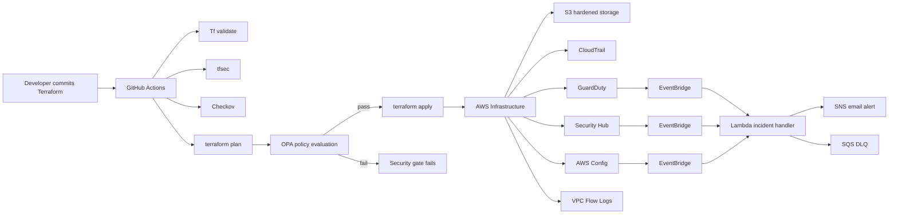

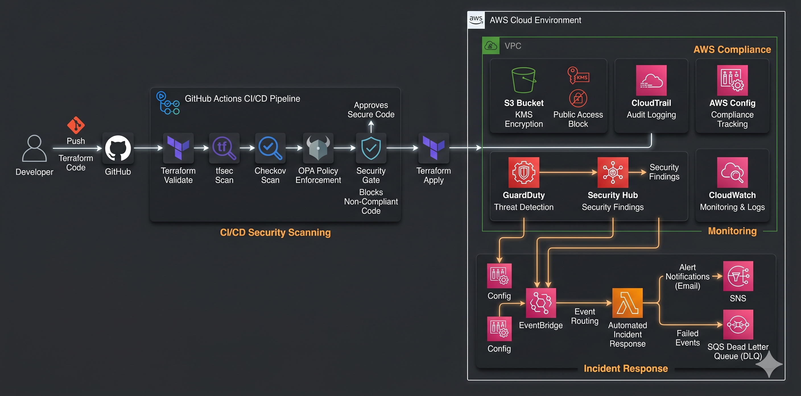

---

## Full DevSecOps Pipeline Flow

The actual workflow in the repository is:

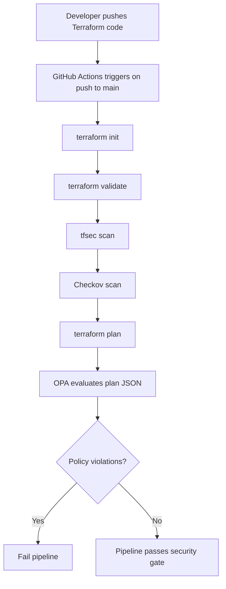

### Intended end-to-end promotion flow

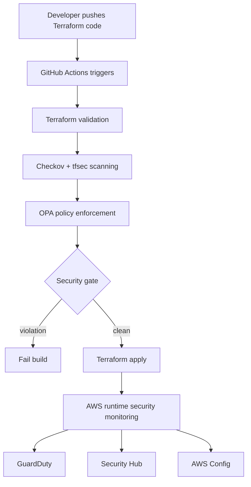


---

## Security Layers

### 1) IaC Security

The Terraform code hardens infrastructure before it is deployed:

- S3 buckets use **server-side encryption with KMS**
- Public access is blocked on data and log buckets
- Buckets have versioning enabled
- Lifecycle rules keep data retention bounded
- OPA denies insecure S3 and IAM patterns
- Checkov and tfsec scan the Terraform source

### 2) Runtime Security

Once deployed, the environment is monitored through:

- **CloudTrail** for API activity and control-plane auditability
- **GuardDuty** for threat detection
- **VPC Flow Logs** for network visibility
- **AWS Config** for resource state tracking
- **Security Hub** for finding aggregation

### 3) Monitoring and Response

Events are routed into an automated response chain:

- EventBridge matches GuardDuty, Security Hub, and Config events
- Lambda formats the event into a human-readable alert
- SNS distributes email alerts
- SQS acts as a dead-letter queue for Lambda failures

---

## AWS Services Used

| Service | Role in the project |
|---|---|
| Amazon S3 | Secure application bucket, log bucket, CloudTrail bucket, Config bucket |
| AWS KMS | Encryption for S3, logs, SNS, Lambda, and DLQ |
| AWS GuardDuty | Threat detection |
| AWS Security Hub | Central findings aggregation |
| AWS Config | Compliance recording and drift visibility |
| AWS CloudTrail | Multi-region audit logging |
| Amazon EventBridge | Event routing to Lambda |
| AWS Lambda | Incident handler and alert formatter |
| Amazon SNS | Email notification delivery |
| Amazon SQS | Dead-letter queue |
| Amazon CloudWatch Logs | Log retention for CloudTrail and VPC Flow Logs |
| VPC Flow Logs | Network telemetry |
| IAM | Roles and policies for CloudTrail, Lambda, VPC flow logs, and Config |

---

## Tools & Tech Stack

- **Terraform**
- **AWS provider**
- **GitHub Actions**
- **tfsec**
- **Checkov**
- **OPA / Rego**
- **Python 3.11**
- **Boto3**
- **Amazon EventBridge**
- **Amazon SNS**
- **Amazon SQS**
- **AWS Lambda**
- **AWS KMS**
- **AWS Config**
- **GuardDuty**
- **Security Hub**
- **CloudTrail**
- **CloudWatch Logs**
- **VPC Flow Logs**

### Policy-as-Code Coverage

The repo includes three custom OPA policies:

- `encryption.rego` blocks S3 resources without server-side encryption
- `iam.rego` blocks overly permissive IAM policies containing `*:*`
- `tagging.rego` blocks S3 resources missing the `Owner` tag

---

## Repository Structure

```text
├── .github/
│   └── workflows/
│       └── devsecops.yml
│
├── .checkov.yaml
├── .gitignore
│
├── images/
│
├── architecture.md
├── compliance.md
├── README.md
├── threat-model.md
│
├── policies/
│   └── opa/
│       ├── encryption.rego
│       ├── iam.rego
│       └── tagging.rego
│
├── lambda/
│   └── incident_handler.py
│
└── terraform/
    ├── backend.tf
    ├── providers.tf
    ├── variables.tf
    ├── terraform.tfstate
    ├── terraform.tfstate.backup
    ├── terraform.tfvars
    ├── .terraform.lock.hcl
    │
    ├── environments/
    │   └── dev/
    │       ├── main.tf
    │       ├── variables.tf
    │       ├── terraform.tfvars
    │       ├── terraform.tfstate
    │       └── terraform.tfstate.backup
    │
    ├── modules/
    │   ├── s3/
    │   │   ├── main.tf
    │   │   ├── variables.tf
    │   │   └── outputs.tf
    │   │
    │   └── security-services/
    │       ├── main.tf
    │       ├── securityhub_config.tf
    │       ├── variables.tf
    │       └── lambda.zip
```

### Repo-specific observation

The uploaded snapshot includes Terraform state files inside the `dev` environment. In a clean production repository, those files should remain excluded from source control.

---

## How to Run

### Prerequisites

- AWS account with permissions for Terraform provisioning
- AWS CLI configured
- Terraform installed
- GitHub repository secrets for:
  - `AWS_ACCESS_KEY_ID`
  - `AWS_SECRET_ACCESS_KEY`
  - `AWS_REGION`

### Step-by-step

1. **Prepare backend resources**
   - The backend is configured for:
     - S3 bucket: `cloud-sec-terraform-state-unique`
     - DynamoDB table: `terraform-locks`
     - Region: `us-east-1`
   - These backend resources must exist before `terraform init`.

2. **Review environment variables**
   - Edit `terraform/environments/dev/terraform.tfvars`
   - Set the alert email for SNS subscription

3. **Initialize the environment**
   ```bash
   cd terraform/environments/dev
   terraform init
   ```

4. **Validate Terraform**
   ```bash
   terraform validate
   ```

5. **Generate a plan**
   ```bash
   terraform plan
   ```

6. **Run local security checks**
   - tfsec scans the Terraform folder
   - Checkov scans the Terraform folder
   - OPA evaluates `terraform show -json` output against `policies/opa`

7. **Apply infrastructure**
   ```bash
   terraform apply
   ```

8. **Confirm SNS email subscription**
   - AWS sends a subscription confirmation email
   - Confirm the subscription before expecting alerts


---

## Testing & Validation

The repo is designed to validate three alert paths.

### 1) GuardDuty test

Trigger or simulate a finding that matches:

- `source = aws.guardduty`
- `detail-type = GuardDuty Finding`

The Lambda handler reads:

- `detail.type`
- `detail.severity`
- `detail.description`
- `detail.accountId`
- `detail.region`

### 2) Security Hub test

Trigger or simulate an EventBridge event that matches:

- `source = aws.securityhub`
- `detail-type = Security Hub Findings - Imported`

The Lambda formats the first finding in `detail.findings[0]`.

### 3) AWS Config test

Trigger or simulate an event that matches:

- `source = aws.config`
- `detail-type = Config Rules Compliance Change`

The Lambda reports:

- resource type
- resource ID
- change type

### Validation method

- Verify EventBridge rule matching
- Verify Lambda invocation
- Verify SNS email delivery
- Verify DLQ usage for failed invocation paths
- Verify CloudWatch logs for Lambda execution
- Verify CloudTrail, Config, and GuardDuty are producing telemetry

---

## Real Alert Examples

These examples match the event formatting logic in `lambda/incident_handler.py`.

### GuardDuty Alert

```text
🚨 GuardDuty Alert 🚨

Type: Policy:IAMUser/RootCredentialUsage
Severity: 5
Description: Root user performed suspicious action from IP 103.218.237.110
Account: 019769366736
Region: us-east-1
```
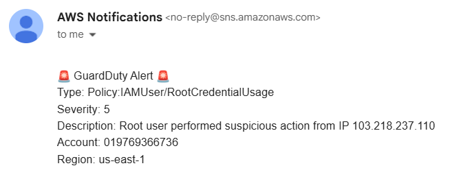

### Security Hub Alert

```text
🔐 Security Hub Alert 🔐

Title: Classic Load Balancer should span multiple Availability Zones
Severity: INFORMATIONAL
Resource: AWS::::Account:019769366736
Description: This control checks whether a Classic Load Balancer has been configured to span at least the specified number of Availability Zones (AZs). The control fails if the Classic Load Balancer does not span at least the specified number of AZs. Unless you provide a custom parameter value for the minimum number of AZs, Security Hub uses a default value of two AZs.
```
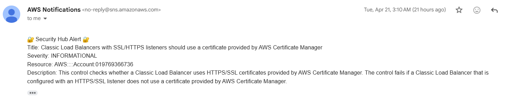

### AWS Config Alert

```text
⚙️ AWS Config Change ⚙️

Resource Type: AWS::IAM::Role
Resource ID: AROAQJGSYTDIHKIEHKVYI
```
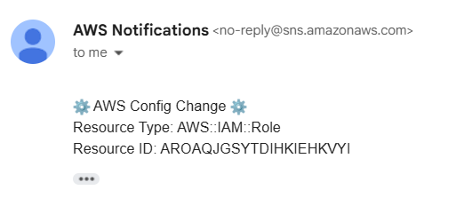

These are representative examples based on the repo’s alert schema and should be used as validation payloads during testing.

---

## Screenshots


### GitHub Actions Pipeline Run
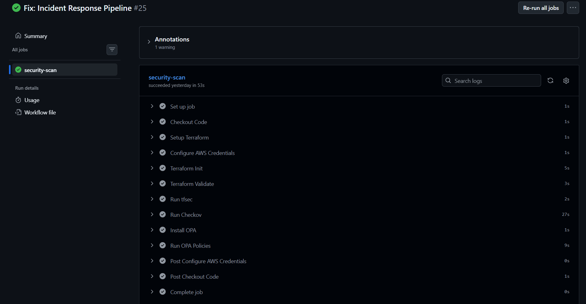

---

### tfsec Results
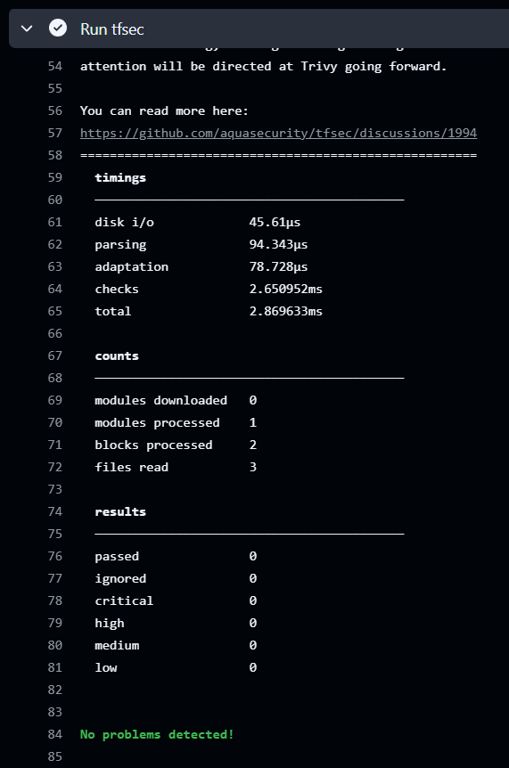

---

### Checkov Results
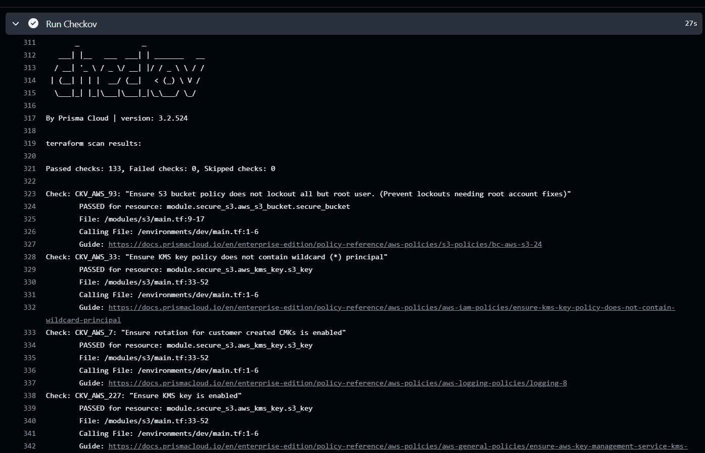

---

### OPA Denial/Pass Example
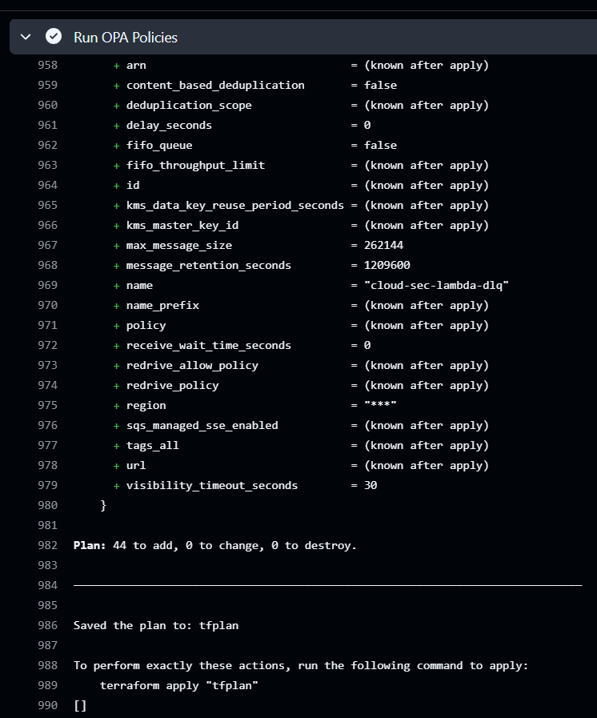

---

### GuardDuty Finding (AWS Console)
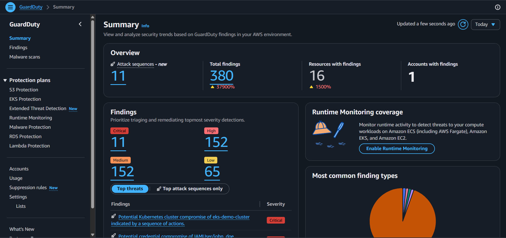

---

### Security Hub Finding (AWS Console)
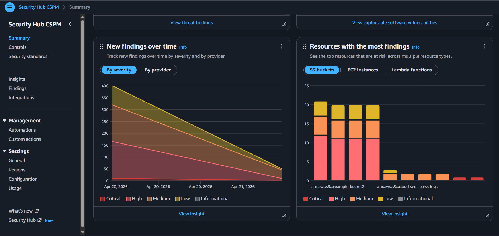

---

### AWS Config Compliance Status
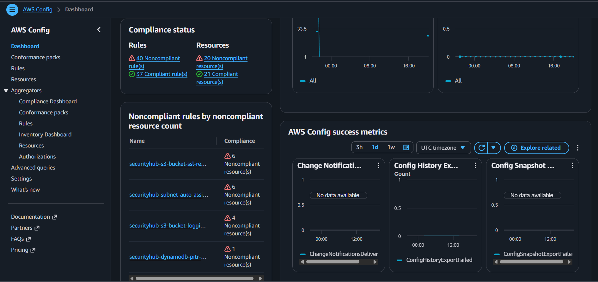

---

### SNS Email Alert
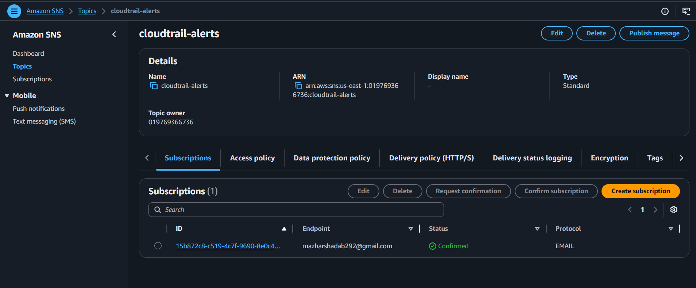

---

### Lambda CloudWatch Log Output
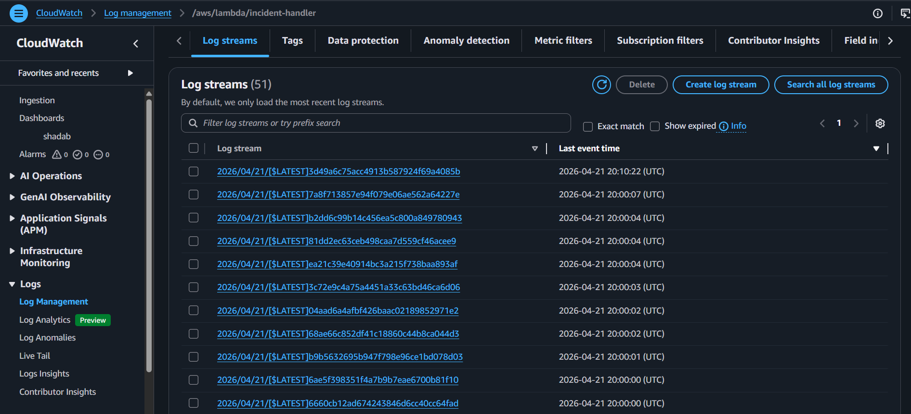

---

## Results & Impact

This project delivers concrete security outcomes:

- Infrastructure is blocked before deployment if it violates policy
- Sensitive AWS resources are encrypted and access-restricted by default
- Compliance drift is visible through AWS Config
- Threat findings are centralized and routed automatically
- Alert fatigue is reduced by using a single incident handler
- Security telemetry is durable through CloudTrail, Flow Logs, and CloudWatch retention
- Log and notification paths are protected with KMS and DLQ controls

---

## Real-World Use Cases

- Secure landing zone bootstrapping
- DevSecOps baseline for a small AWS environment
- Continuous security validation of Terraform pull requests or merges
- Compliance-ready logging and detection stack for regulated workloads
- Incident notification platform for cloud security teams
- Reference architecture for cloud security portfolio or interview demonstrations

---

## Why This Project Is Production-Ready

This repository shows production intent because it combines:

- separate Terraform modules
- remote backend configuration
- KMS-based encryption
- public access blocking
- versioning and lifecycle controls
- security scanning in CI
- policy-as-code enforcement
- runtime monitoring
- multi-service alert routing
- dead-letter queue handling
- modular incident response logic

The code is also structured to be extended cleanly into multi-account and multi-environment deployments.

---

## Final Summary

CloudSec Sentinel is a strong DevSecOps and cloud security portfolio project because it combines secure Terraform design, CI security checks, runtime AWS detections, and automated incident routing in one architecture. It is not just infrastructure provisioning; it is a security control system that detects, validates, and responds.

The project is especially relevant for DevSecOps, Cloud Security Engineer, and Security Automation roles because it shows the exact skills teams want in production: **IaC hardening, policy enforcement, monitoring, alerting, and compliance visibility**.
