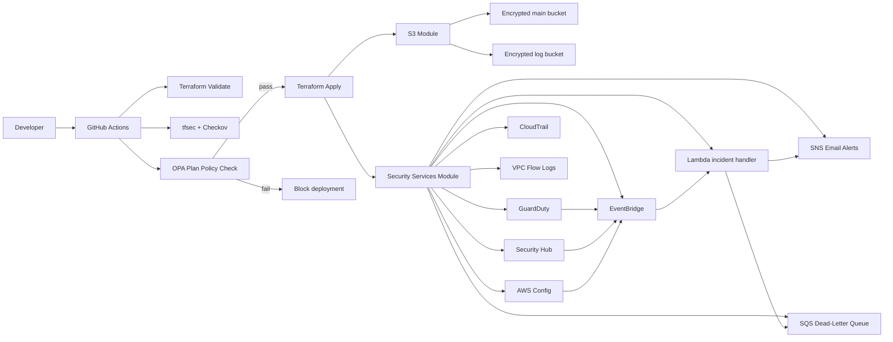
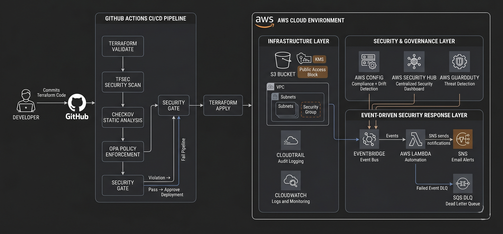
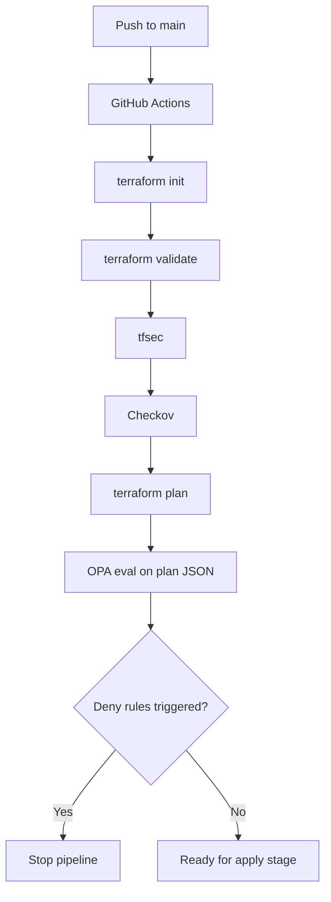
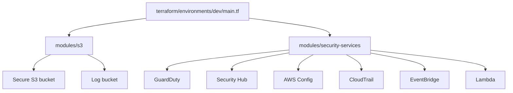
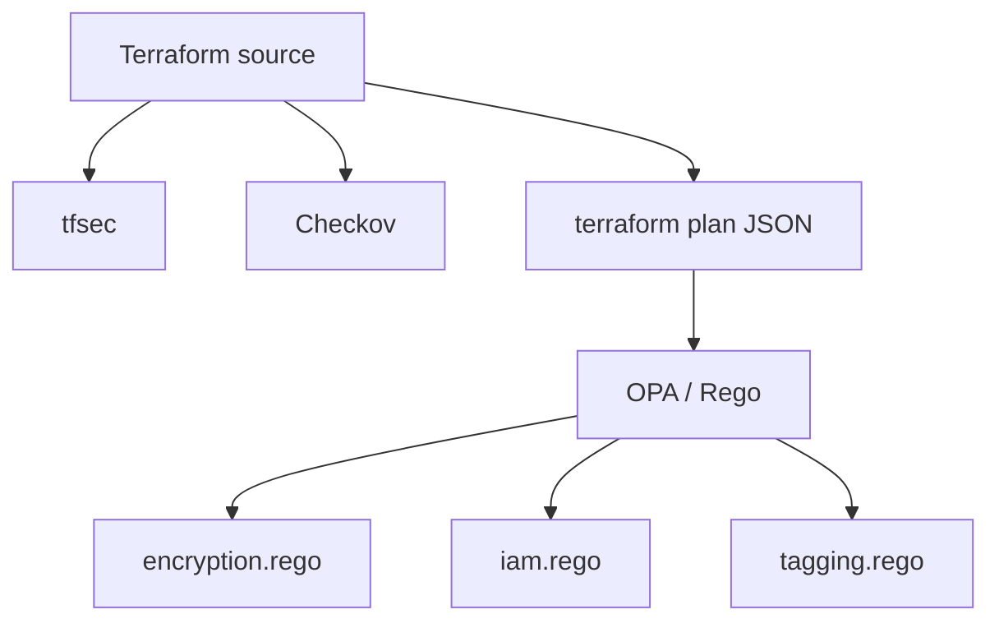
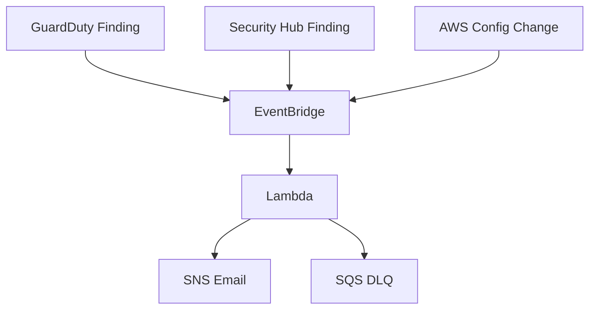

# Architecture Documentation

## System Purpose

This architecture provisions a hardened AWS security baseline using Terraform and then layers continuous detection and response on top of it. The infrastructure is designed to protect S3 storage, preserve audit evidence, detect threats, and notify operators automatically.

---

## 1) CI/CD Layer

### What it does

The GitHub Actions workflow acts as the first security checkpoint. On every push to `main`, it performs:

- repository checkout
- Terraform setup
- AWS credential configuration
- `terraform init`
- `terraform validate`
- `tfsec` scan
- `Checkov` scan
- `terraform plan`
- OPA evaluation against the generated plan JSON

### Why it matters

This layer prevents insecure Terraform from reaching AWS. It is the place where policy violations should be caught before deployment.

### Repo-specific implementation

The workflow file is `.github/workflows/devsecops.yml`. It currently ends after OPA evaluation. The repository does **not** yet include a Terraform apply job in the workflow.

---

## 2) IaC Layer

### Root Terraform layout

- `terraform/backend.tf` defines the remote backend
- `terraform/providers.tf` configures the AWS provider
- `terraform/environments/dev/main.tf` wires the modules together
- `terraform/modules/s3` creates the secure storage layer
- `terraform/modules/security-services` creates the security and monitoring layer

### Design approach

The IaC is split into modules to keep responsibilities clear:

- `s3` module = encrypted, versioned, public-blocked buckets
- `security-services` module = detection, logging, alerting, and compliance services

This modular split makes the stack easier to audit, reuse, and extend.

---

## 3) Security Scanning Layer

### Tools used

- **tfsec** for Terraform security checks
- **Checkov** for policy and misconfiguration detection
- **OPA** for custom logic that is specific to this repository

### Custom OPA policies

- `encryption.rego` blocks S3 buckets without server-side encryption
- `iam.rego` blocks IAM policies containing `*:*`
- `tagging.rego` blocks S3 buckets missing the `Owner` tag

### Why this layer is useful

Terraform scanners catch many common issues, but not every organization-specific rule. OPA fills that gap and allows the team to define its own deploy-time rules.

---

## 4) AWS Infrastructure Layer

### Secure storage

The S3 module provisions:

- a main bucket
- a log bucket
- versioning
- KMS encryption
- public access blocks
- access logging
- lifecycle expiration

### Security services

The security-services module provisions:

- KMS key for logs and alerts
- GuardDuty detector
- Security Hub account
- AWS Config recorder and delivery channel
- CloudTrail
- VPC Flow Logs
- EventBridge rules
- Lambda incident handler
- SNS topic and email subscription
- SQS dead-letter queue
- CloudWatch log groups
- IAM roles and policies

---

## 5) Monitoring Layer

### GuardDuty

GuardDuty is enabled with a fifteen-minute finding publishing frequency. It provides threat detection for suspicious AWS activity.

### Security Hub

Security Hub is enabled as a central findings plane. The standards subscription is present in the repo but commented out in `securityhub_config.tf`.

### AWS Config

AWS Config continuously records resource configuration and delivers snapshots into a dedicated S3 bucket. This supports compliance checks and drift review.

### CloudTrail

CloudTrail is configured as a multi-region trail with log file validation enabled. That makes the audit trail more defensible and tamper-aware.

### VPC Flow Logs

The default VPC flow logs are enabled and routed into CloudWatch Logs for network telemetry.

---

## 6) Incident Response Layer

### Event routing

Three EventBridge rules route events to the same Lambda function:

- GuardDuty findings
- Security Hub findings
- AWS Config compliance changes

### Lambda behavior

The incident handler reads the `source` field and formats a different alert body for each event family. It then publishes the message to SNS.

### Notification path

SNS delivers email alerts to the configured security notification address. Lambda also has a DLQ configured with SQS to preserve failed events.

---

## Architecture Diagram

---

## CI/CD Layer Detail

---

## IaC Layer Detail

---

## Security Scanning Layer Detail

---

## Monitoring Layer Detail

---

## Incident Response Behavior

The Lambda function in `lambda/incident_handler.py` handles three event families:

- **GuardDuty**: prints type, severity, description, account, and region
- **Security Hub**: prints title, severity, resource ID, and description
- **AWS Config**: prints resource type, resource ID, and change type

The handler then publishes a unified alert into SNS, which simplifies response operations and keeps the notification path consistent across services.

---

## Why the Architecture Is Strong

- Each domain has a dedicated module.
- Security is enforced before deploy and after deploy.
- Controls are layered rather than duplicated.
- Alerts are routed through a single incident path.
- The design is understandable for both engineers and auditors.
