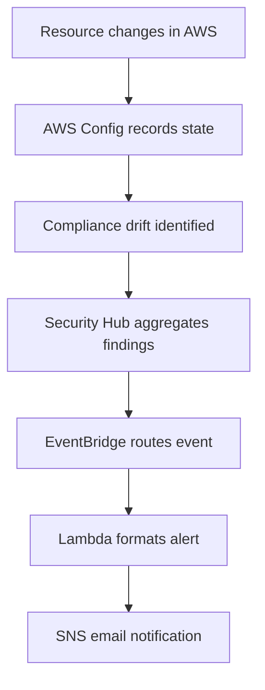

# Compliance Mapping

## Scope

This project maps to AWS security and compliance expectations by combining:

- encrypted storage
- audit logging
- config tracking
- threat detection
- centralized findings
- policy-as-code gates
- operational alerting

The most relevant baselines are:

- **AWS Foundational Security Best Practices**
- **CIS AWS Benchmarks**

---

## Compliance Alignment Summary

| Control Area | Project Implementation | Compliance Benefit |
|---|---|---|
| S3 encryption | KMS-backed SSE on buckets | Protects data at rest |
| Public access blocking | Enabled on protected buckets | Reduces accidental exposure |
| Versioning | Enabled on key buckets | Supports recovery and traceability |
| Audit logging | CloudTrail multi-region trail | Preserves account activity evidence |
| Configuration tracking | AWS Config recorder + delivery channel | Tracks drift and resource state |
| Threat detection | GuardDuty enabled | Detects suspicious activity |
| Findings aggregation | Security Hub enabled | Centralizes controls and findings |
| Log retention | CloudWatch log retention configured | Supports evidence retention |
| Alerting | EventBridge + Lambda + SNS | Ensures actionable notification |
| Policy gate | tfsec + Checkov + OPA | Prevents insecure infrastructure from deploying |

---

## AWS Foundational Security Best Practices Mapping

### 1. Logging and monitoring

Implemented through:

- CloudTrail
- CloudWatch Logs
- VPC Flow Logs
- GuardDuty
- Security Hub
- AWS Config

This gives visibility into activity, configuration, and threats.

### 2. Storage security

Implemented through:

- S3 server-side encryption
- public access blocks
- versioning
- lifecycle policies
- KMS key usage

This strengthens storage confidentiality and recoverability.

### 3. Identity and access management

Implemented through:

- dedicated IAM roles for CloudTrail, Lambda, VPC Flow Logs, and Config
- policy-as-code checks for overly permissive IAM
- separate functional roles for different services

### 4. Incident response

Implemented through:

- EventBridge rules
- Lambda incident handler
- SNS notification delivery
- SQS DLQ fallback

---

## CIS Benchmark Mapping

### CIS control themes covered by the project

#### Logging
- CloudTrail is enabled
- multi-region trail is used
- log file validation is enabled

#### Monitoring
- GuardDuty is enabled
- Security Hub account is enabled
- AWS Config recording is enabled

#### Storage hardening
- S3 buckets are encrypted
- public access is blocked
- log buckets have retention rules

#### Network visibility
- VPC Flow Logs are enabled

These controls align with the operational intent of CIS benchmark guidance, especially around logging, detection, and resource hardening.

---

## How Config and Security Hub Enforce Compliance

### AWS Config

AWS Config continuously records resource configuration and stores the history in a dedicated S3 bucket. This gives the security team a point-in-time view of:

- what changed
- when it changed
- which resource changed
- whether the resource remains compliant

### Security Hub

Security Hub acts as the findings aggregation layer. In this repository, the account-level enablement is present. The standards subscription is commented out, but the control plane is already shaped to receive and route findings.

### Combined effect

- Config detects drift and compliance deltas.
- Security Hub aggregates findings into a central security posture view.
- EventBridge sends those signals to Lambda for notification.

---

## Drift Detection Strategy

### Drift control logic in this project

- Infrastructure is defined in Terraform, not manually in the console
- AWS Config records resource changes
- Security Hub collects findings from multiple services
- Alerts are routed automatically to maintain response speed

---

## Continuous Monitoring Strategy

### Preventive
- Terraform security scans
- OPA policy denial rules
- public access blocks
- encryption by default

### Detective
- GuardDuty
- Security Hub
- AWS Config
- CloudTrail
- VPC Flow Logs

### Responsive
- EventBridge
- Lambda
- SNS
- SQS DLQ

This layered model matches how compliance programs work in practice: stop bad changes, detect what slips through, and preserve enough telemetry to prove what happened.

---

## Evidence Readiness

The architecture is designed to help with audit evidence because it keeps:

- change history in Terraform
- activity logs in CloudTrail
- resource state history in Config
- findings in Security Hub and GuardDuty
- notifications and execution traces in CloudWatch and SNS

That makes the project suitable for security review, audit walkthroughs, and recruiter demonstrations.

---

## Implementation Notes

### Security Hub standards
The standards subscription is currently commented out in `securityhub_config.tf`. To fully operationalize a benchmark scorecard, it should be enabled.

### Backend control
The backend uses S3 plus DynamoDB locking, which is the expected pattern for team Terraform use.

### Retention strategy
The project uses lifecycle expiration on log and config buckets so compliance data remains manageable without becoming unbounded.
