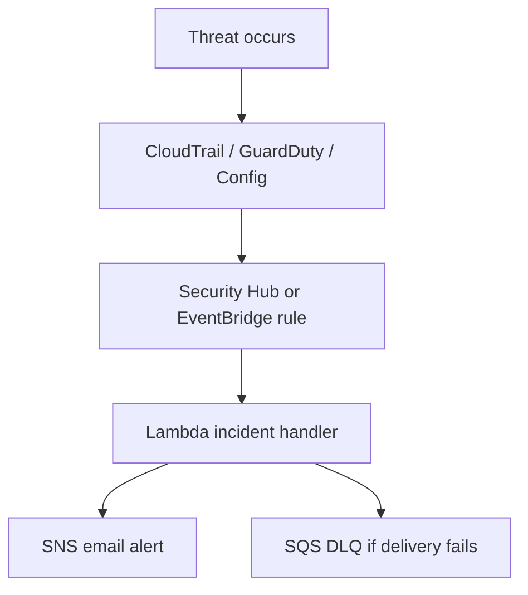

# Threat Model

## Scope

This threat model covers the infrastructure and automation present in the repository:

- Terraform-based AWS provisioning
- S3 storage and log buckets
- GuardDuty, Security Hub, AWS Config, CloudTrail
- EventBridge to Lambda incident routing
- SNS email alerts and SQS dead-letter queue
- GitHub Actions CI security gates
- Custom OPA policies

---

## Primary Threats

### 1) IAM Abuse

#### Risk
An attacker or overprivileged workflow could use a broad IAM policy to perform actions outside the intended scope.

#### Where it matters in this repo
- Lambda execution role
- CloudTrail and VPC flow log roles
- Any future IAM policies added to Terraform
- OPA policy coverage for IAM misconfiguration

#### Attack scenarios
- A workflow introduces a policy with `*:*`
- A compromised role is used to enumerate or modify resources
- Excessive permissions allow log deletion or alert suppression

#### Detection
- Checkov and tfsec can flag common IAM misconfigurations
- OPA explicitly denies IAM policies containing `*:*`
- CloudTrail records privileged API calls
- GuardDuty may flag anomalous IAM behavior

#### Mitigation
- Least-privilege IAM roles
- OPA enforcement for policy shape
- Review privilege escalation paths before apply
- Monitor CloudTrail for unusual IAM operations

---

### 2) Root Usage

#### Risk
Root-level permissions in KMS policies can be dangerous if the account root is used operationally or if key policy boundaries are too broad.

#### Where it matters in this repo
- KMS policies in the S3 and logs encryption layers
- The policies explicitly grant account-root access for administrative control

#### Attack scenarios
- Root keys are used where a narrower admin role would be better
- A compromised root session can access or change sensitive KMS materials
- Broad root-based key access weakens separation of duties

#### Detection
- CloudTrail can show root API usage
- GuardDuty may highlight unusual account-level behavior
- Security Hub can surface risk findings tied to account governance

#### Mitigation
- Use a dedicated admin role instead of root for day-to-day operations
- Keep root MFA enabled and unused except for break-glass scenarios
- Restrict KMS key policies to specific admin roles where practical
- Audit root usage through CloudTrail

---

### 3) Public S3 Exposure

#### Risk
Buckets can become publicly readable or writable through policy mistakes, ACL drift, or missing access blocks.

#### Where it matters in this repo
- Main S3 bucket
- Log bucket
- CloudTrail bucket
- AWS Config delivery bucket
- Access log bucket

#### Attack scenarios
- A bucket is created without a public access block
- A policy allows unintended public read access
- A logging bucket is exposed and audit data becomes visible
- Misconfigured ACLs bypass policy intent

#### Detection
- tfsec and Checkov flag public S3 exposure patterns
- OPA enforces encryption and tagging, and can be extended to block public exposure
- AWS Config can track bucket configuration drift
- Security Hub can surface public access findings

#### Mitigation
- Public access block enabled everywhere
- Encryption at rest with KMS or AES256 where appropriate
- Versioning and lifecycle rules for controlled retention
- Add an OPA rule for public bucket policies if the project expands further

---

### 4) Misconfiguration Risk

#### Risk
The most realistic failure mode in a Terraform security project is configuration drift or deployment of insecure defaults.

#### Where it matters in this repo
- Backend settings
- Provider region alignment
- EventBridge rule patterns
- Lambda environment and permissions
- Security Hub standards enablement
- Hardcoded values in module variables

#### Attack scenarios
- Terraform applies in the wrong region
- EventBridge rules miss an event because the pattern is too narrow
- Lambda cannot publish alerts because permissions are incomplete
- Security Hub is enabled but standards are not subscribed
- A committed tfvars file leaks operational details

#### Detection
- `terraform validate`
- `terraform plan`
- tfsec
- Checkov
- OPA
- AWS Config
- CloudTrail
- Lambda CloudWatch logs

#### Mitigation
- Use modular design with explicit dependencies
- Keep env-specific values in variables and secret stores
- Add deployment tests for EventBridge event patterns
- Enable standards in Security Hub
- Remove committed state and sensitive tfvars from version control

---

## Threat Scenarios and Response Mapping

| Scenario | Detection source | Response path |
|---|---|---|
| IAM policy too permissive | OPA, Checkov, tfsec | Block merge or apply |
| Suspicious AWS API activity | CloudTrail, GuardDuty | EventBridge → Lambda → SNS |
| Public bucket exposure | tfsec, Checkov, Config, Security Hub | Block deployment or remediate |
| Config drift on protected resources | AWS Config | EventBridge → Lambda → SNS |
| Failed alert delivery | Lambda error path | SQS DLQ for replay |

---

## Detection Flow

---

## Mitigation Strategy by Control Plane

### Terraform controls
- Encrypted S3 buckets
- Public access blocks
- Versioning and lifecycle
- Secure KMS-backed log storage
- DLQ for failed Lambda events

### Policy controls
- OPA deny rules for encryption, IAM, and tagging
- Checkov and tfsec scanners in CI

### Monitoring controls
- GuardDuty for anomalous activity
- Security Hub for aggregation
- AWS Config for drift
- CloudTrail for audit evidence

### Response controls
- EventBridge routing
- Lambda incident formatting
- SNS email notifications
- SQS dead-letter queue

---

## Residual Risk

The repository materially reduces common cloud-security risks, but it still depends on:

- correct AWS credential management in GitHub Actions
- correct backend bootstrap
- human review of apply decisions
- consistent region and variable alignment
- enabling all intended Security Hub standards

Those are normal residual risks for a real-world DevSecOps stack and are best controlled through process plus policy.
